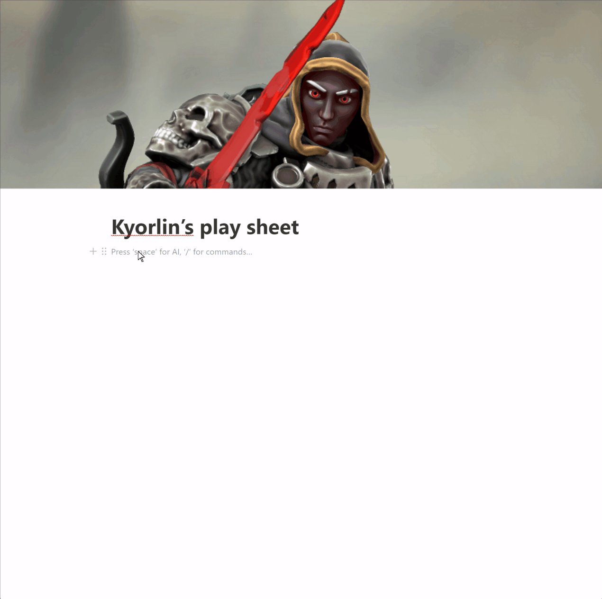

# Notion D&D Widgets

🗒️ Version: 1.0.0

🔗 https://feliperamis.github.io/dnd-helpers/


This repository has the purpose of creating small Notion widgets (embedded pages) to enhance a D&D play sheet.


## Widgets

There are 2 widgets:

- **Life widget**: Control your HP, Maximum HP and Temporal HP by healing or damaging your character by 1 point
- **Abilities widget**: List of abilities you character may have and control whether you used them or not. Its main purpose is to cover all of the daily usage abilities that can only be recovered by a long rest but you can use it even for spell slots.

## How to use

1. Create your character


2. Embed the widgets to your Notion page




## ⚠️⚠️Caveats

This widgets use the local storage of your device. In a browser environment it works perfectly fine but if you use the Notion desktop/mobile/Ipad app it may not keep your data saved. 

## Future

In case this widgets are used, I have in mind some features to add like:

- Death save widget
- Spell slots widget
- Hit dices and short rest
- Edit character
- Progress bar for the life helper


# Development

## How to setup project

This project was made by Vue.js 3  and Vite SSG (Static site generator) with the prerender option of Vite ([More info here](https://vite-plugin-ssr.com/pre-rendering)).

```sh
npm install
npm run dev
```


#### Lint with [ESLint](https://eslint.org/)

```sh
npm run lint
```

#### Deploy

Every push to the main branch will create a deployment to Github pages thanks to the Github workflows.